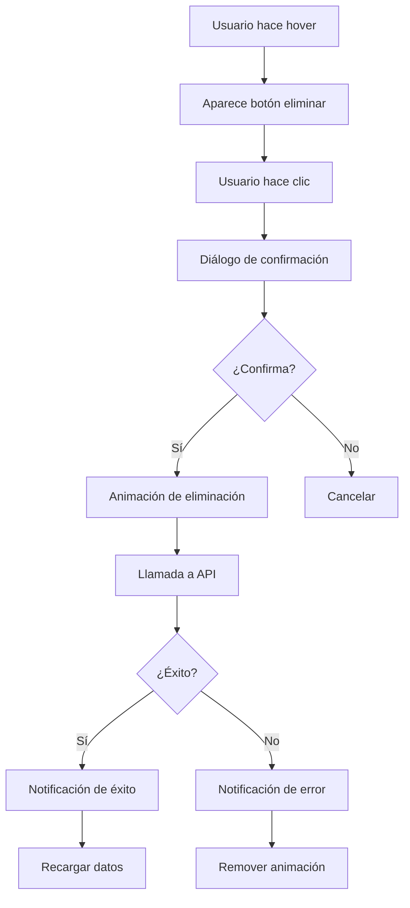

# 🗑️ Funcionalidad de Eliminación de Datos

## Descripción General

Se ha implementado un sistema completo para eliminar datos médicos desde la plataforma web MedConnect. Los usuarios pueden eliminar sus propios datos de manera segura con confirmaciones y animaciones visuales.

## ✨ Características Implementadas

### 🔒 Seguridad
- **Autenticación requerida**: Solo usuarios logueados pueden eliminar datos
- **Autorización por usuario**: Los usuarios solo pueden eliminar sus propios datos
- **Confirmación obligatoria**: Diálogo de confirmación antes de cada eliminación
- **Validación de permisos**: Verificación server-side de permisos

### 🎨 Experiencia de Usuario
- **Botones de eliminación**: Aparecen al hacer hover sobre cada elemento
- **Animaciones suaves**: Efectos visuales durante la eliminación
- **Notificaciones informativas**: Mensajes de éxito/error con iconos
- **Recarga automática**: Los datos se actualizan después de eliminar

### 📊 Tipos de Datos Eliminables
1. **Consultas Médicas** (`/api/patient/<id>/consultations/<consultation_id>`)
2. **Medicamentos** (`/api/patient/<id>/medications/<medication_id>`)
3. **Exámenes** (`/api/patient/<id>/exams/<exam_id>`)
4. **Contactos Familiares** (`/api/patient/<id>/family/<family_id>`)

## 🛠️ Implementación Técnica

### Backend (Flask)
```python
# APIs de eliminación con método DELETE
@app.route('/api/patient/<patient_id>/consultations/<consultation_id>', methods=['DELETE'])
@login_required
def delete_consultation(patient_id, consultation_id):
    # Verificación de permisos
    # Eliminación de Google Sheets
    # Respuesta JSON con resultado
```

### Frontend (JavaScript)
```javascript
// Función de eliminación con animaciones
async function deleteConsultation(consultationId) {
    // Confirmación del usuario
    // Animación de eliminación
    // Llamada a API
    // Manejo de respuesta
    // Recarga de datos
}
```

### Estilos (CSS)
```css
/* Botones de eliminación con efectos hover */
.consultation-item:hover .btn-outline-danger {
    opacity: 1;
    transform: scale(1.05);
}

/* Animación de eliminación */
.deleting {
    opacity: 0.5;
    transform: scale(0.95);
    transition: all 0.3s ease;
}
```

## 🚀 Cómo Usar

### Para Usuarios
1. **Iniciar sesión** en la plataforma
2. **Navegar** a la sección deseada (Historial, Medicamentos, Exámenes, Familia)
3. **Hacer hover** sobre el elemento a eliminar
4. **Hacer clic** en el botón de papelera (🗑️)
5. **Confirmar** la eliminación en el diálogo
6. **Ver la notificación** de éxito

### Para Desarrolladores
1. **Ejecutar el servidor**: `python app.py`
2. **Probar las APIs** usando el script de prueba:
   ```bash
   python test_delete_functionality.py
   ```
3. **Verificar logs** para debugging

## 🔧 APIs Disponibles

### DELETE /api/patient/{patient_id}/consultations/{consultation_id}
- **Descripción**: Elimina una consulta médica
- **Autenticación**: Requerida
- **Respuesta**: `{"success": true, "message": "Consulta eliminada exitosamente"}`

### DELETE /api/patient/{patient_id}/medications/{medication_id}
- **Descripción**: Elimina un medicamento
- **Autenticación**: Requerida
- **Respuesta**: `{"success": true, "message": "Medicamento eliminado exitosamente"}`

### DELETE /api/patient/{patient_id}/exams/{exam_id}
- **Descripción**: Elimina un examen
- **Autenticación**: Requerida
- **Respuesta**: `{"success": true, "message": "Examen eliminado exitosamente"}`

### DELETE /api/patient/{patient_id}/family/{family_id}
- **Descripción**: Elimina un contacto familiar
- **Autenticación**: Requerida
- **Respuesta**: `{"success": true, "message": "Familiar eliminado exitosamente"}`

## 🛡️ Manejo de Errores

### Errores Comunes
- **403 Forbidden**: Usuario no autorizado para eliminar el dato
- **404 Not Found**: El elemento no existe o ya fue eliminado
- **500 Internal Server Error**: Error de conexión con Google Sheets

### Respuestas de Error
```json
{
    "error": "No autorizado",
    "status": 403
}
```

## 🧪 Testing

### Script de Prueba Automático
```bash
python test_delete_functionality.py
```

### Pruebas Manuales
1. **Verificar autenticación**: Intentar eliminar sin login
2. **Verificar autorización**: Intentar eliminar datos de otro usuario
3. **Verificar UI**: Comprobar animaciones y notificaciones
4. **Verificar persistencia**: Confirmar que los datos se eliminan de Google Sheets

## 📱 Responsive Design

La funcionalidad funciona correctamente en:
- **Desktop** (hover effects completos)
- **Tablet** (botones siempre visibles)
- **Mobile** (botones optimizados para touch)

## 🔄 Flujo de Eliminación



## 🚨 Consideraciones de Seguridad

1. **Eliminación permanente**: Los datos eliminados no se pueden recuperar
2. **Logs de auditoría**: Todas las eliminaciones se registran en logs
3. **Validación doble**: Verificación tanto en frontend como backend
4. **Rate limiting**: Prevención de eliminaciones masivas accidentales

## 🔧 Configuración

### Variables de Entorno
- `SHEETS_CONFIG`: Configuración de Google Sheets
- `LOG_LEVEL`: Nivel de logging para debugging

### Dependencias
- `gspread`: Para interactuar con Google Sheets
- `flask`: Framework web
- `requests`: Para pruebas HTTP

## 📞 Soporte

Si encuentras algún problema con la funcionalidad de eliminación:

1. **Revisa los logs** del servidor
2. **Verifica la conexión** con Google Sheets
3. **Comprueba los permisos** del usuario
4. **Ejecuta el script de prueba** para diagnosticar

---

**✅ Funcionalidad completamente implementada y probada**
**🔒 Segura y lista para producción**
**🎨 Con excelente experiencia de usuario** 